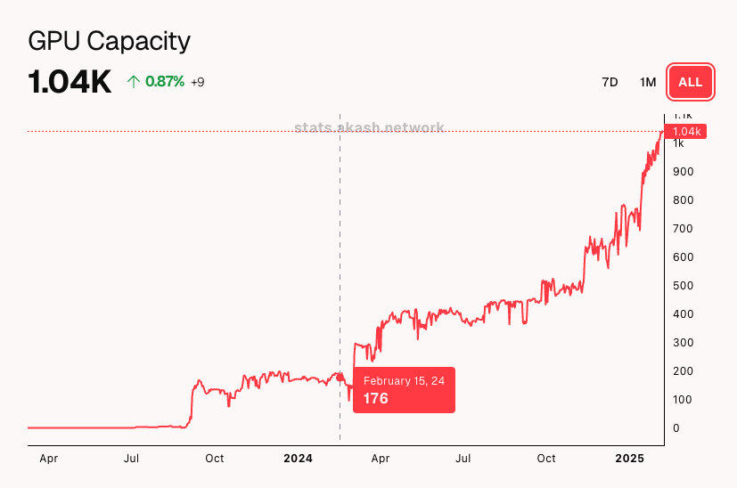
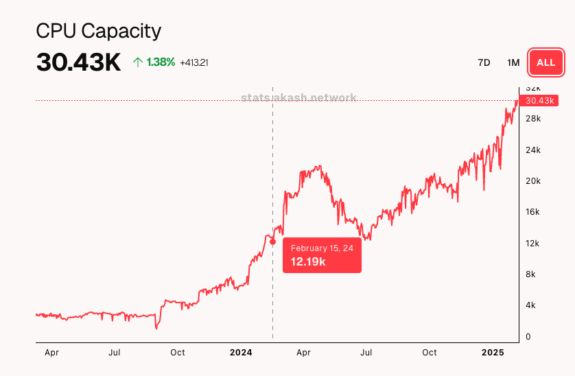
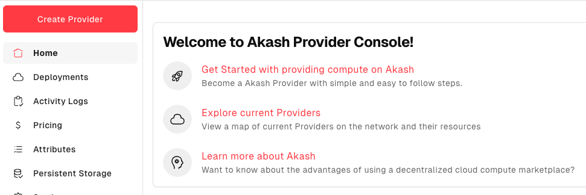
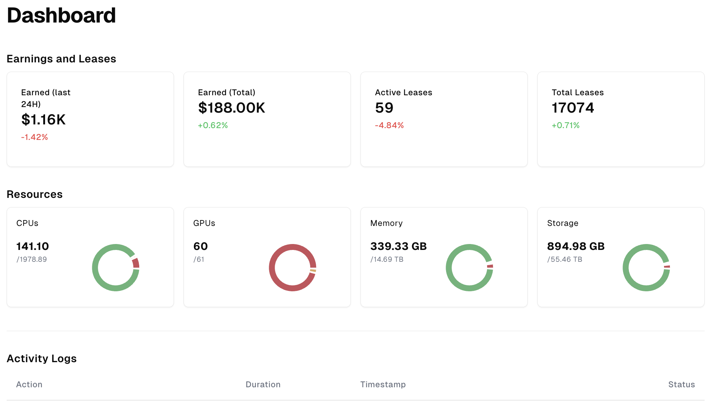
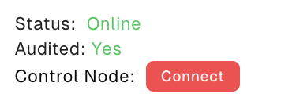
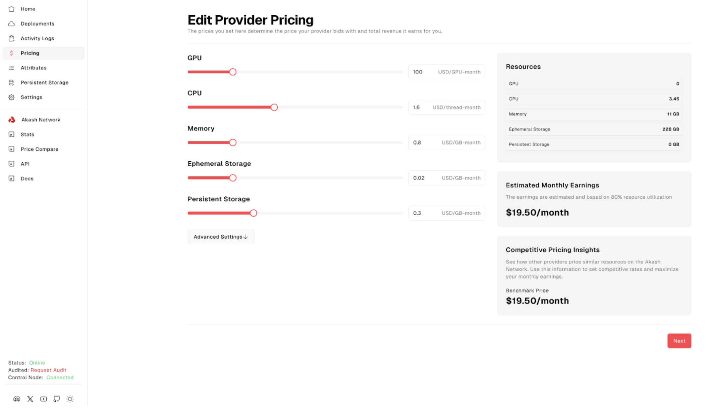
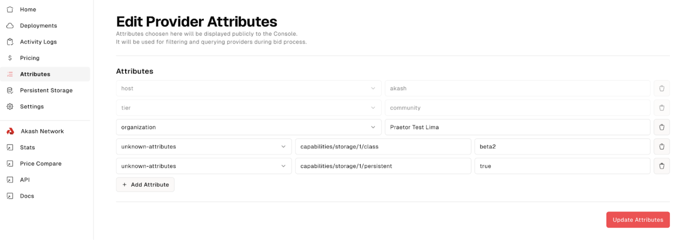
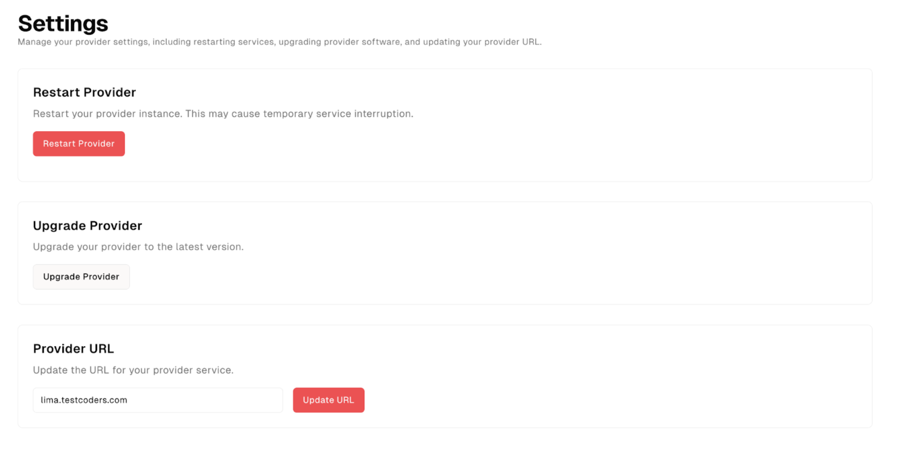

by [Jigar Patel](https://x.com/pateljigar053), [Deval Patel](https://x.com/Deval_Vora), and [Anil Murty](https://x.com/_Anil_Murty_)

The Akash core team is excited to announce the general availability of Akash Provider Console. Akash Provider Console aims to be the easiest and most elegant way for compute providers (including datacenter operators) of all sizes to become Akash Providers, as well as the primary way that existing Akash Providers view and manage resources on the network.

## Why was Akash Provider Console built?

Akash has experienced significant growth over the past year, primarily driven by demand from AI workloads. This demand has led to many new GPU providers joining the network — growing [GPU capacity on the network by over 600% and CPU capacity by about 250%](https://stats.akash.network).

|  |  |
| :---- | :---- |

While that growth is impressive, Akash expects to grow much more on both the demand and supply side in 2025 and beyond. More importantly, in working with many providers throughout 2023 and 2024, the Akash core team realized that there is a significant number of datacenter operators who would like to be part of the network but do not have the technical expertise or the resources to onboard their servers and maintain an Akash provider. The desire to prioritize solving that problem drove the [merger of the PraetorApp team with the Akash Network core team in 2024](https://github.com/orgs/akash-network/discussions/525) and subsequently led to the creation of Akash Provider Console. 

Akash Provider Console adds key functionality that was missing from PraetorApp (including the requirement to have a Kubernetes cluster pre-configured), along with improving the overall user experience (UX). It also updates the branding and UI design to be consistent with the Akash Deploy Console. Most importantly, Akash Provider Console provides a platform for the core team to continue quickly iterating on new features that will attract new providers by improving the provider setup process.

Let’s take a look at all the features included in this initial release of Akash Provider Console.

## Key Features

### Streamlined Onboarding
New datacenter operators looking to bring their compute resources to Akash are presented with an easy-to-follow onboarding process.  

Clicking **`Create Provider`** leads the user through the setup process step-by-step, starting with specifying the number of servers.

### Automated Kubernetes Install
Akash Provider Console also removes the burden of manually installing Kubernetes. To get started, a new provider simply provides virtual machines, and Akash Provider Console does the rest. This includes deciding how many “control nodes” and how many “worker nodes” to set up based on the total server count.

### Dashboard for Leases & Earnings
Once a provider is up and running, the default homepage view in Akash Provider Console displays a dashboard of the provider resources and overall usage. This includes revenue earned, leases, used/available resources by type (GPU, CPU, memory, and storage). The dashboard also features an activity log that displays key changes made to the provider during or after setup.

### Status & Control Node Access
At the bottom of the left sidebar is an **Overall (online/offline) Status Indicator**, an **Audit Status indicator** (if the provider is not currently audited, a link will be shown to submit an audit request form), and a button to **Connect with the Control Node**.   

### Deployment Management
The Deployments page shows an overall count of workloads running on the provider and per-deployment information, including the owner wallet, the spend, and a count of leased resources.

### Pricing Management
The pricing page is where providers can view and update pricing by resource type. The page also estimates what the provider can expect to earn monthly (assuming 80% utilization). To help providers price their infrastructure competitively, a comparative benchmark is provided based on other similar providers’ pricing on the network.  

### Attributes Management
The Attributes page lets the provider manager add, delete, or edit the list of attributes configured on the provider. Correct attribute configuration is essential for the provider to be discovered by users via Akash Deploy Console.

### Persistent Storage Configuration & Management
Configuring Persistent Storage can also be done from within the interface by navigating to the corresponding page via the side menu  

### Provider Maintenance Features
The Settings page provides maintenance tools to restart the provider, upgrade its software, and update the provider hostname.

## Getting Started
The Akash core team and community can’t wait to hear from providers on the network about what they think of Akash Provider Console and more importantly, are excited to continue building features that improve the provider experience as they support workloads on Akash. Feedback is always welcomed.

Get started with Akash Provider Console here: [provider-console.akash.network](https://provider-console.akash.network/)

[Explore the Akash Roadmap](https://akash.network/roadmap/2025/) to learn more about upcoming features and initiatives, and [sign up for the newsletter](https://akashnet.typeform.com/to/awKX5bPw) to stay up to date with the latest from Akash.

If you are interested in becoming an Akash provider or interested in deploying on Akash, [reach out to the core team.](https://share.hsforms.com/1gQOaeJXgQ-GMc7MnsTOmsAsaima)
